# 🍽️ MealRush – Restaurant Online Ordering Platform

A full-stack, fully responsive e-commerce application for a restaurant. Customers browse the menu, add items to a cart and check out either with **PayHere (sandbox)** online payment or by sending the complete order to the restaurant on **WhatsApp**. Customers get a profile with their order history, and staff manage the menu, stock and orders from a protected **Admin Panel**.

| | |
|---|---|
| **Live app** | <<https://meal-rush-web.vercel.app/>> |
| **Admin login** | <<https://meal-rush-web.vercel.app/admin/login>> |
| **API health check** | <<https://mealrush-api.onrender.com/api/v1/health>> |
| **Repository** | <<https://github.com/senura_medagoda/meal-rush-ordering-platform>> |

### Demo credentials
| Role | Where to log in | Email | Password |
|---|---|---|---|
| Admin | `/admin/login` | <<admin@mealrush.lk>> | <<ChangeMe@12345>> |
| Customer | `/login` | Register a new account, or use <<customer email>> | <<customer password>> |

> **Notes for reviewers**
> - The API runs on a free hosting tier. If the very first request is slow, the server was waking up.
> - PayHere runs in **sandbox** mode. Use PayHere's sandbox test cards. No real money moves.
> - Admin accounts can only sign in on `/admin/login`. Customer accounts can only sign in on `/login`.

---

## Table of contents
1. [Screenshots](#screenshots)
2. [Features](#features)
3. [Tech stack](#tech-stack)
4. [Architecture](#architecture)
5. [Database design](#database-design)
6. [Checkout flows](#checkout-flows)
7. [Security approach](#security-approach)
8. [API overview](#api-overview)
9. [Local setup](#local-setup)
10. [Deployment](#deployment)
11. [Key technical decisions](#key-technical-decisions)
12. [Assumptions and limitations](#assumptions-and-limitations)
13. [Roadmap](#roadmap)

---

## Screenshots

### Customer storefront
| Home | Menu with search and filters |
|---|---|
| 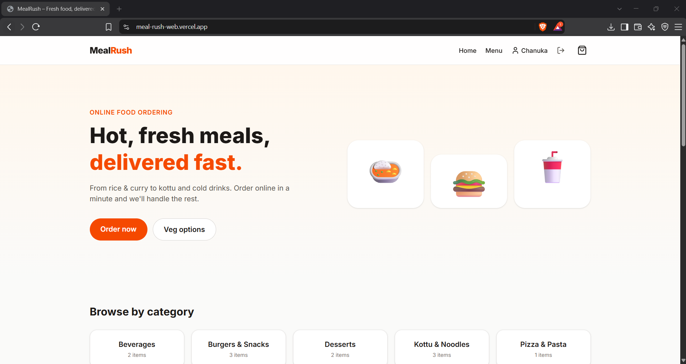 | 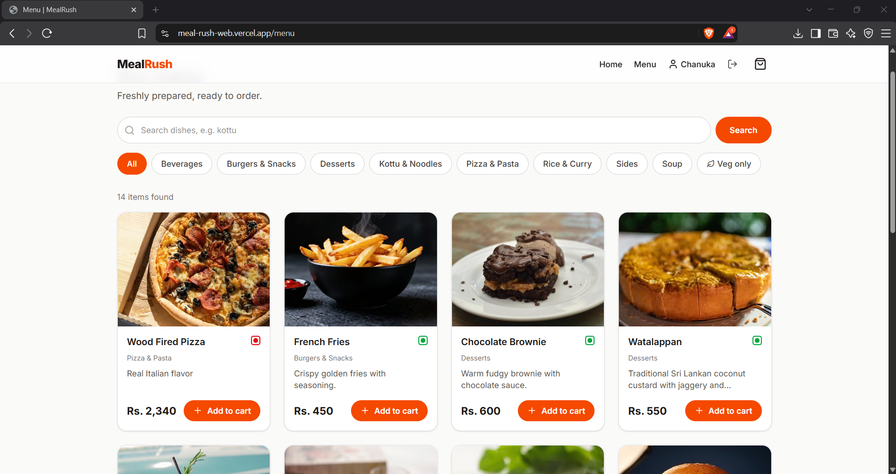 |

| Product details | Cart |
|---|---|
| 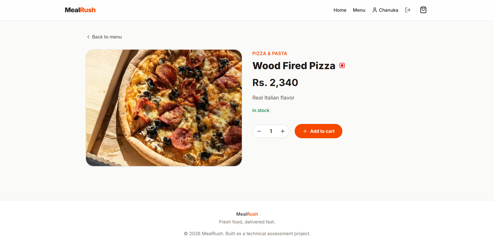 | 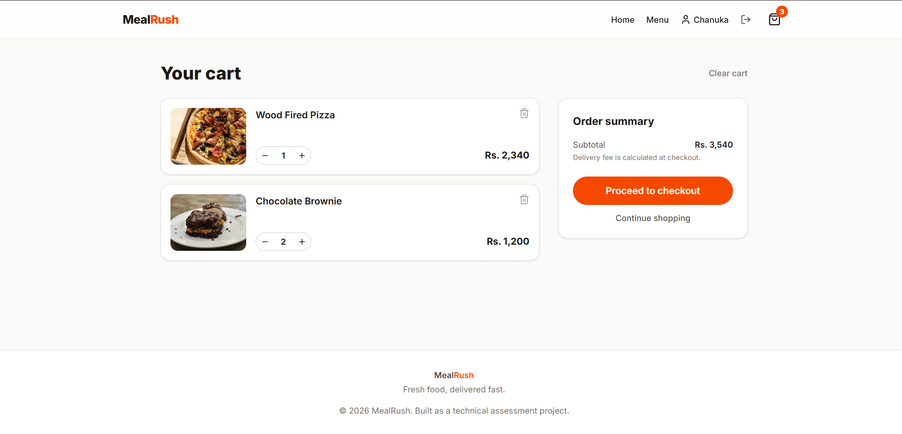 |

### Checkout (PayHere or WhatsApp)
| Checkout form | PayHere sandbox payment page |
|---|---|
| 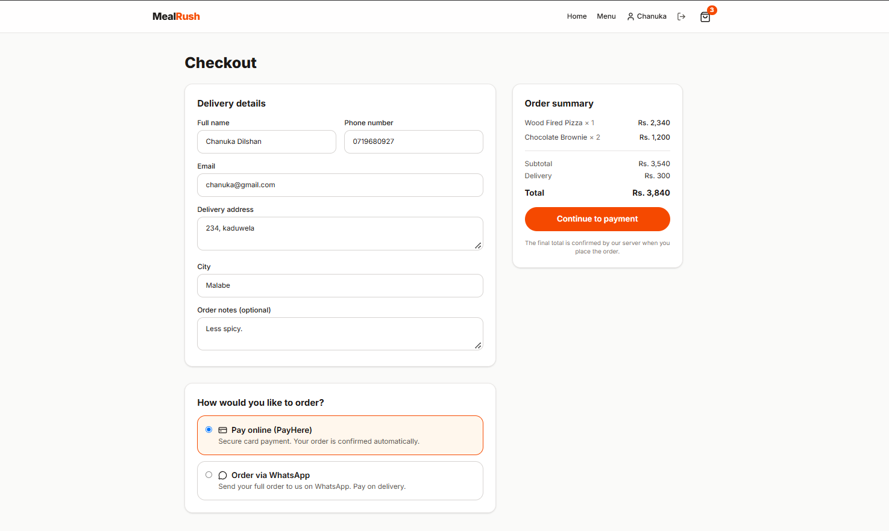 | 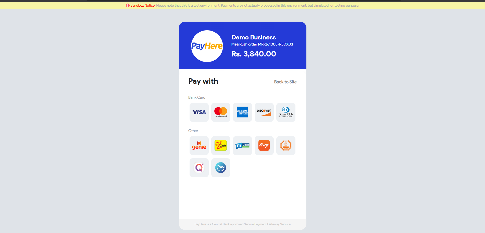 |

### Customer account
| Profile and order history |
|---|
| 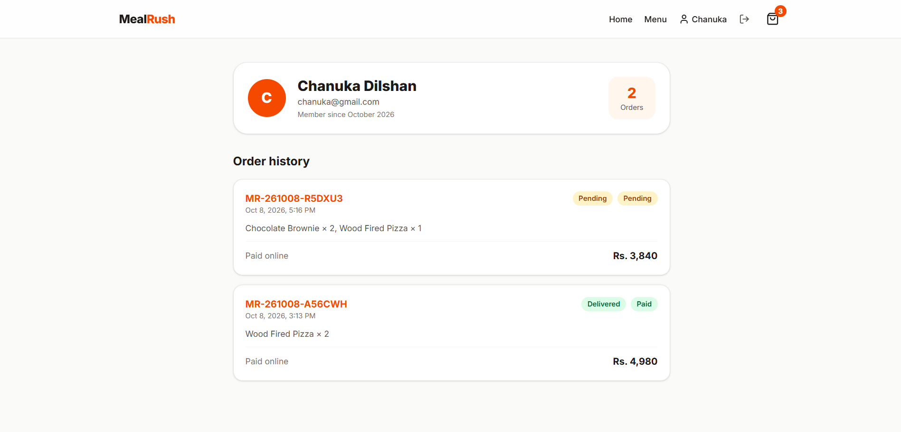 |

### Admin panel
| Admin login | Dashboard |
|---|---|
| 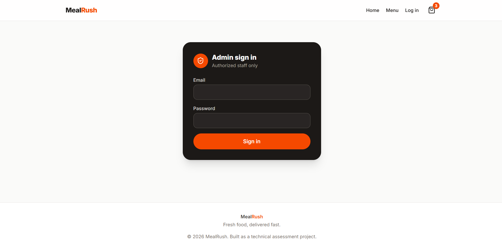 | 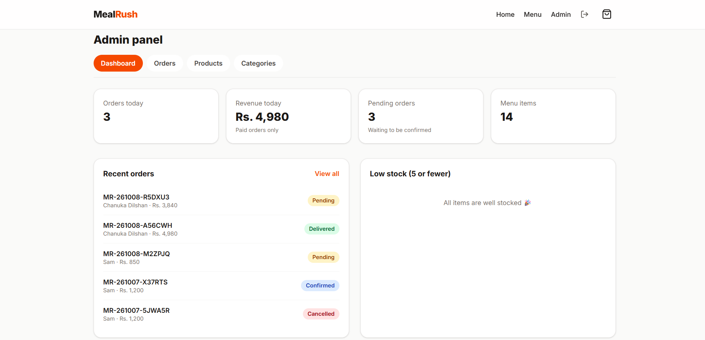 |

| Orders | Order details and status workflow |
|---|---|
| 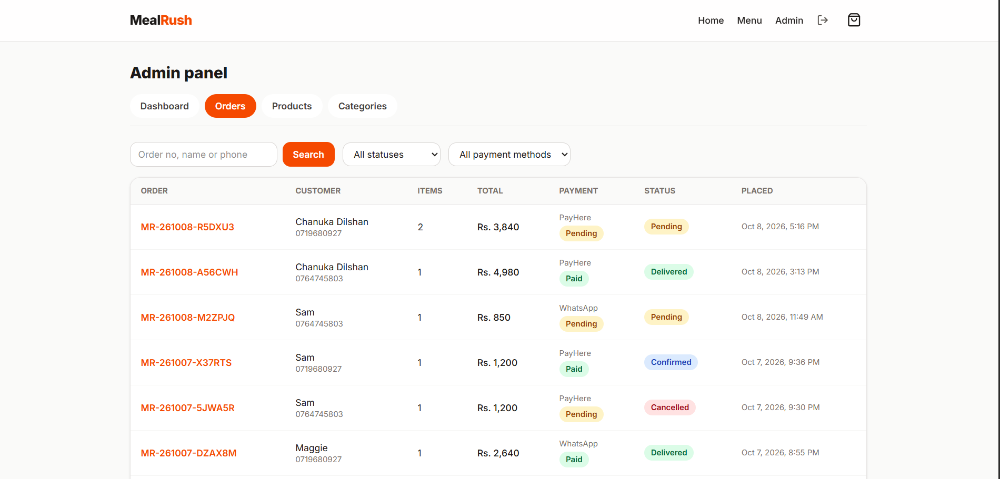 | 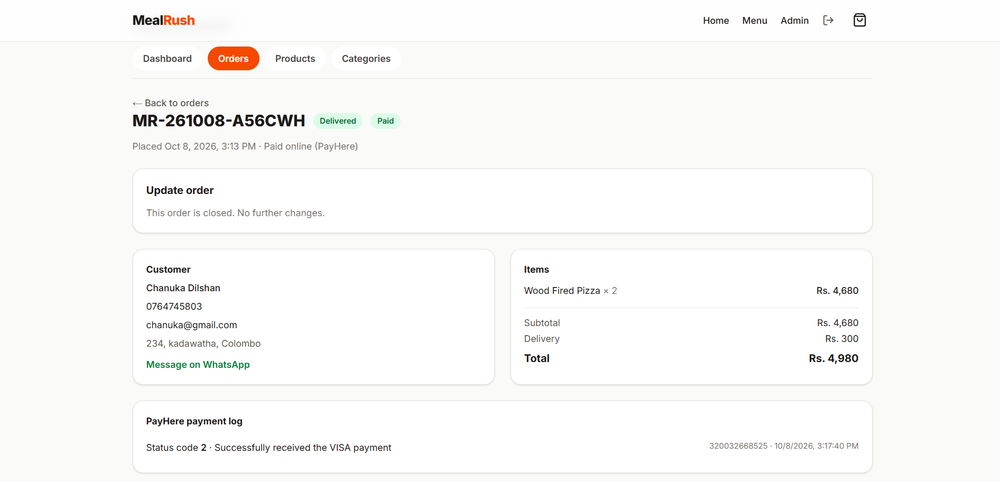 |

| Products Page|
|---|
| 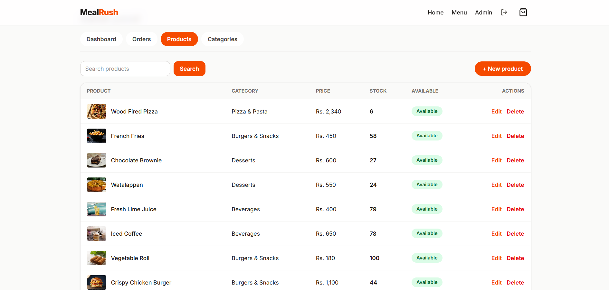 |


| Product form with image upload |
|---|
| 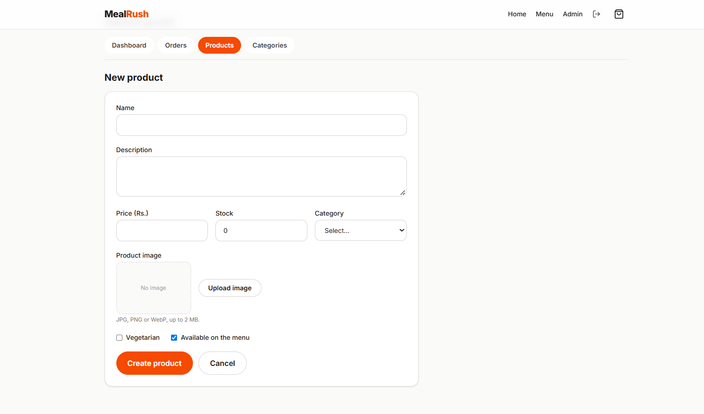 |

### Responsive design
| Menu on mobile | Checkout on mobile |
|---|---|
| 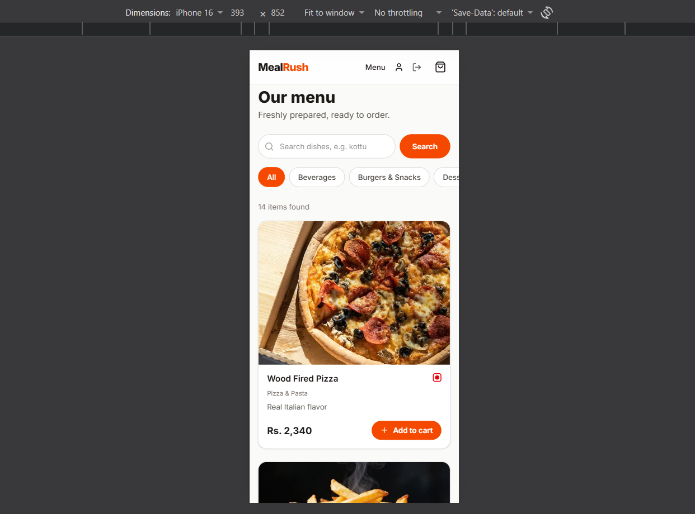 | 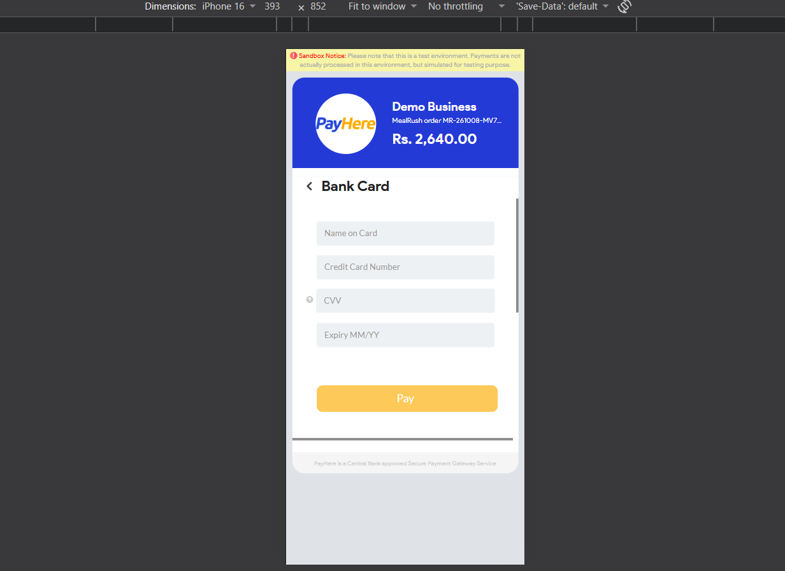 |

---

## Features

**Customer**
- Menu with text search, category filter, vegetarian filter and pagination
- Product detail pages with stock status
- Persistent cart (saved in the browser)
- Guest checkout or registered-account checkout
- **PayHere** online payment (sandbox) with automatic confirmation
- **WhatsApp ordering**: the full cart is sent as a clear, readable message
- Order status page with a live progress timeline
- Profile page with account details and **order history**
- Register, login and logout

**Admin**
- Separate **admin-only login page**
- Dashboard: today's orders, paid revenue, pending orders, low-stock alerts
- Order management: filters, search, detail view, status workflow, manual "paid" for cash orders
- Product management: create, edit, delete, availability toggle, stock, **direct image upload (Cloudinary)**
- Category management

---

## Tech stack

| Layer | Technology | Why |
|---|---|---|
| Frontend | Next.js (App Router), TypeScript, Tailwind CSS | Server-rendered pages, fast, responsive |
| State | Zustand | Light cart and auth state; cart saved in localStorage |
| Backend | NestJS, TypeScript | Modular structure: controllers, services, DTOs, guards |
| Database | PostgreSQL (Neon) | Relational data: orders, items, stock |
| ORM | Prisma | Typed queries and migrations |
| Auth | JWT in an httpOnly cookie, bcrypt | Not readable from JavaScript; role-based access |
| Payments | PayHere Sandbox | Required by the brief |
| Images | Cloudinary | Server-validated uploads, CDN delivery |
| Hosting | Vercel (web), Render (API), Neon (DB) | Free tiers |

---

## Architecture

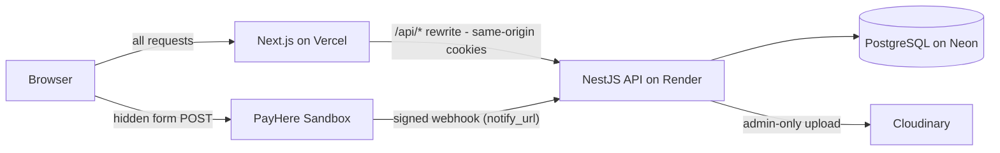

The browser only talks to the Next.js origin. Next.js proxies `/api/*` to the NestJS API, so the login cookie is first-party and works on Safari and iOS. PayHere's webhook calls the API directly.

### Project structure
```
meal-rush-ordering-platform/
├── apps/
│   ├── api/                      NestJS backend
│   │   ├── prisma/               schema, migrations, seed script
│   │   ├── scripts/              local PayHere webhook simulator
│   │   └── src/
│   │       ├── auth/             register, customer login, admin login, guards
│   │       ├── categories/
│   │       ├── products/         public + admin controllers
│   │       ├── orders/           checkout, tracking, admin order management, cleanup job
│   │       ├── payments/         PayHere hash + webhook verification
│   │       ├── uploads/          admin image upload to Cloudinary
│   │       └── common/           shared helpers and exception filter
│   └── web/                      Next.js frontend
│       └── src/
│           ├── app/              pages: storefront, checkout, order status, profile, admin
│           ├── components/
│           ├── hooks/
│           ├── lib/
│           └── store/            cart and auth state
├── docs/screenshots/
└── README.md
```

---

## Database design

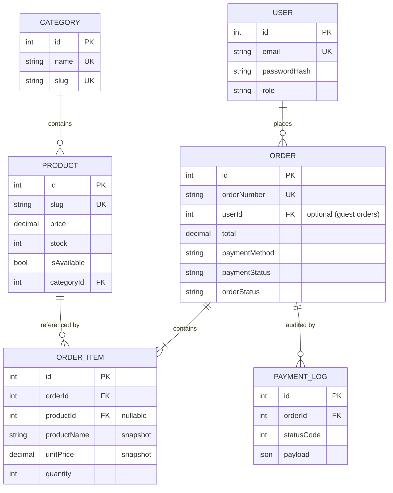

- **OrderItem stores a snapshot** of the product name and unit price, so later menu edits never change past orders.
- Money uses `Decimal(10,2)`, never floating point.
- `Order.userId` is optional, so guests can check out.
- Deleting a product keeps order history (`productId` becomes null; the snapshot remains).
- Indexes on foreign keys, order status and creation date.

### Order lifecycle
`PENDING → CONFIRMED → PREPARING → OUT_FOR_DELIVERY → DELIVERED`, with `CANCELLED` allowed before delivery. The API rejects invalid jumps. Cancelling returns the reserved stock.

---

## Checkout flows

### PayHere (online payment)
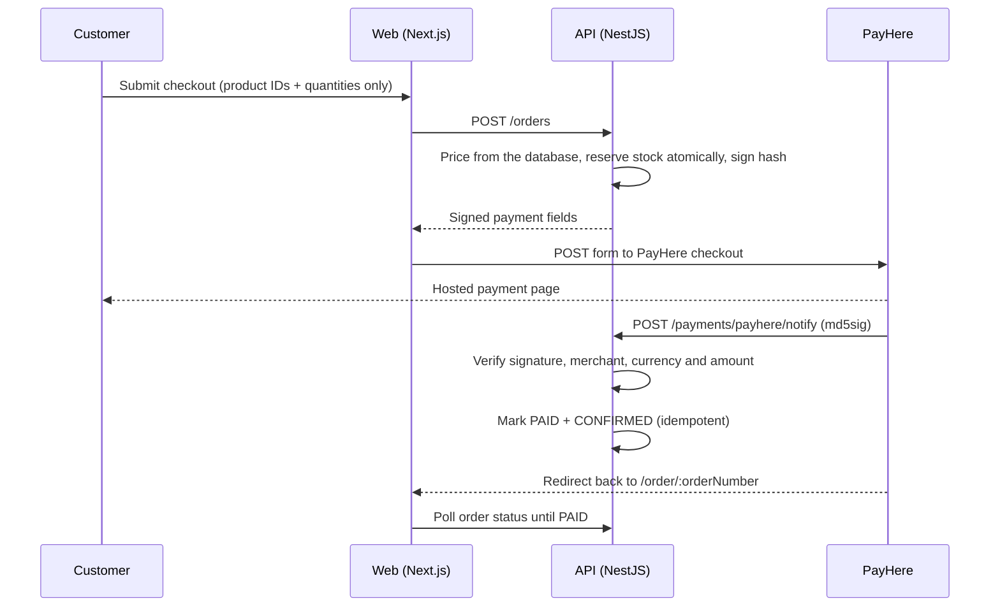

### WhatsApp order
1. The order is **saved first**, so it always appears in the admin panel.
2. The API returns a `wa.me` link containing a readable message: order number, customer details, each item with quantity and line total, subtotal, delivery fee, total and notes.
3. The customer taps **Send order on WhatsApp**. Payment is on delivery; the admin marks it paid when cash is received.

---

## Security approach

- **Passwords** hashed with bcrypt (cost 12). Login errors use one generic message.
- **Sessions**: JWT in an **httpOnly, secure, SameSite** cookie, so JavaScript cannot read it.
- **Role separation**: `/auth/login` accepts only customers and `/auth/admin/login` accepts only admins, with identical error messages so roles can't be discovered. Registration always creates a `CUSTOMER`.
- **Authorization**: every `/admin/*` route requires a valid session **and** the `ADMIN` role, enforced by guards on the server. The frontend redirect is only for user experience.
- **Validation**: DTOs with `class-validator`, whitelisting and rejection of unknown fields.
- **Server-side pricing**: clients send only product IDs and quantities, so a tampered price is impossible.
- **Atomic stock reservation** (`UPDATE ... WHERE stock >= qty`) inside a transaction, so concurrent orders can't oversell.
- **PayHere**: the hash is generated server-side and the merchant secret never reaches the browser. The webhook verifies the signature (timing-safe), merchant ID, currency and amount, and is idempotent.
- **Uploads**: admin-only, JPG/PNG/WebP, maximum 2 MB, validated on the server; Cloudinary credentials stay on the server.
- **Public order tracking** uses unguessable order numbers and returns no personal data.
- **Configuration**: all secrets live in environment variables (`.env` is git-ignored; `.env.example` is provided).
- **Hardening**: Helmet headers, CORS allow-list, rate limiting (stricter on login, register and order creation).

---

## API overview

Base path: `/api/v1`

| Method | Path | Access |
|---|---|---|
| POST | `/auth/register` | Public |
| POST | `/auth/login` | Public, **customer accounts only** |
| POST | `/auth/admin/login` | Public, **admin accounts only** |
| POST | `/auth/logout` | Public |
| GET | `/auth/me` | Logged in |
| GET | `/categories` | Public |
| POST / PATCH / DELETE | `/categories` | Admin |
| GET | `/products`, `/products/:slug` | Public (search, category, veg, price, pagination) |
| GET / POST / PATCH / DELETE | `/admin/products` | Admin |
| POST | `/admin/uploads/image` | Admin (JPG/PNG/WebP, max 2 MB) |
| POST | `/orders` | Guest or customer |
| GET | `/orders/track/:orderNumber` | Public, no personal data |
| GET | `/orders/my` | Customer (order history) |
| POST | `/payments/payhere/notify` | PayHere webhook, signature verified |
| GET / PATCH | `/admin/orders`, `/admin/orders/:id` | Admin |
| GET | `/admin/stats` | Admin |

---


### Environment variables: `apps/api/.env`
| Variable | Purpose |
|---|---|
| `NODE_ENV` | `development` or `production` (production enables secure cookies and proxy trust) |
| `PORT` | API port (default 4000) |
| `DATABASE_URL` | Pooled PostgreSQL connection string (runtime) |
| `DIRECT_URL` | Direct PostgreSQL connection string (migrations) |
| `JWT_SECRET` | Long random string that signs login tokens |
| `FRONTEND_URL` | Web origin (CORS and PayHere return URLs) |
| `API_PUBLIC_URL` | Public API URL (PayHere `notify_url`) |
| `WHATSAPP_NUMBER` | Restaurant WhatsApp number, digits only, with country code (e.g. `94771234567`) |
| `PAYHERE_MERCHANT_ID`, `PAYHERE_MERCHANT_SECRET` | PayHere sandbox credentials |
| `PAYHERE_CHECKOUT_URL` | `https://sandbox.payhere.lk/pay/checkout` |
| `CLOUDINARY_CLOUD_NAME`, `CLOUDINARY_API_KEY`, `CLOUDINARY_API_SECRET` | Image uploads |
| `ADMIN_EMAIL`, `ADMIN_PASSWORD` | Used by the seed script only |

### Environment variables: `apps/web/.env.local`
| Variable | Purpose |
|---|---|
| `API_URL` | API origin that the Next.js proxy forwards `/api/*` to (e.g. `http://localhost:4000`) |

### Testing the PayHere webhook locally
PayHere cannot reach `localhost`, so a small script sends a correctly signed notification to your local API:
```bash
cd apps/api
npx tsx scripts/simulate-payhere.ts <orderNumber> <amount, e.g. 2900.00> 2
```

---

## Deployment

| Part | Service | Notes |
|---|---|---|
| Frontend | Vercel | Root directory `apps/web`; env `API_URL` |
| API | Render (free web service) | Root directory `apps/api` |
| Database | Neon PostgreSQL | Pooled and direct connection strings |
| Images | Cloudinary | Admin uploads |
| Uptime | UptimeRobot | Pings `/api/v1/health` every 5 minutes to avoid cold starts |

**Render build command:** `npm install --include=dev && npx prisma generate && npx prisma migrate deploy && npm run build`
**Render start command:** `npm run start:prod`

Pushing to `main` redeploys both the API and the web app automatically.

---

## Key technical decisions

- **NestJS + Next.js split**: a clear API boundary and independently deployable parts.
- **Proxy rewrite instead of cross-site cookies**: Safari and other browsers block third-party cookies; routing `/api/*` through Next.js keeps the session first-party.
- **Server decides prices**: the browser never sends a price or a total.
- **Stock reserved at order time**, released when the admin cancels, or when an online payment is never completed (a scheduled job cancels unpaid PayHere orders after 30 minutes).
- **WhatsApp orders are saved before opening WhatsApp**, so the admin sees every order even if the customer never sends the message.
- **PayHere payment status is set only by the verified webhook**; admins can mark WhatsApp orders as paid manually (cash on delivery).
- **Separate login endpoints per role** instead of a single login with a role flag, so privileged access is isolated on the server.
- **Uploads go through the API** (not straight from the browser to Cloudinary), so only an authenticated admin can upload and the secret never reaches the client.

---

## Assumptions and limitations

- PayHere runs in **sandbox** mode; test cards only.
- Delivery fee is a flat Rs. 300, free from Rs. 5,000 (constants in the code).
- Order history only includes orders placed **while logged in**; guest orders aren't linked to an account.
- Replaced or deleted product images are not removed from Cloudinary.
- If a PayHere confirmation arrives after an unpaid order was auto-cancelled, the admin must handle it manually.
- Free-tier hosting means possible cold starts (a monitor keeps the API warm).
- No email or SMS notifications, no refund flow, and automated tests are minimal.

---

## Roadmap

Planned improvements, roughly in priority order.

### 1. Containerization (Docker)
- Multi-stage `Dockerfile` for the API (build stage with dev dependencies, slim runtime stage with only production dependencies and the Prisma client) and one for the Next.js app (standalone output).
- `docker-compose.yml` that starts **web + api + PostgreSQL** with one command, so a new developer can run the full stack locally without installing Node or a database.
- `.dockerignore` files, non-root container users, and `HEALTHCHECK` using `/api/v1/health`.
- Run database migrations as a separate one-off container step rather than at app start.

### 2. CI/CD pipelines (GitHub Actions)
- **On every pull request:** install dependencies, lint, type-check, run tests and build both apps; build the Docker images to catch Dockerfile errors early.
- **On merge to `main`:** build and tag images, push to **Amazon ECR**, run database migrations, then deploy to staging and (after approval) production.
- Authenticate to AWS with **GitHub OIDC** (short-lived credentials, no stored access keys).
- Dependency and image vulnerability scanning, and branch protection requiring a green pipeline before merging.

### 3. Deployment on AWS
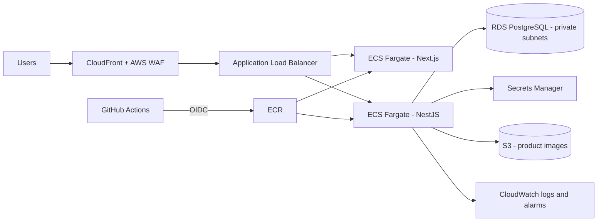
- **Compute:** ECS on Fargate behind an Application Load Balancer, with auto scaling.
- **Database:** Amazon RDS for PostgreSQL in private subnets, with automated backups.
- **Secrets:** AWS Secrets Manager / SSM Parameter Store instead of plain environment variables.
- **Networking and TLS:** VPC with public and private subnets, Route 53 DNS, ACM certificates, CloudFront and WAF in front.
- **Images:** optionally move uploads from Cloudinary to S3 + CloudFront.
- **Observability:** structured logs and alarms in CloudWatch.
- **Infrastructure as code:** Terraform or AWS CDK so the whole environment is reproducible.

### 4. Map-based delivery location picker
Let customers choose their exact delivery location on a map instead of only typing an address.
- **Checkout map** using **Leaflet + OpenStreetMap** (free, no API key): click or drag a pin, or use a **"Use my current location"** button.
- **Reverse geocoding** to fill the address field automatically from the chosen pin.
- **Database:** add `latitude` and `longitude` to `Order` (new Prisma migration) with server-side validation of the coordinates.
- **Delivery rules:** check the pin against a delivery radius from the restaurant (Haversine distance) and optionally calculate the delivery fee by distance, all on the server.
- **Admin and WhatsApp:** show the pin on a small map in the admin order detail with an "Open in Google Maps" link, and include a Google Maps link in the WhatsApp order message so the rider can navigate directly.

### 5. Other improvements
- Automated tests: unit tests for pricing, stock and webhook verification, plus end-to-end tests for the checkout flow.
- Email and SMS notifications for order confirmation and status updates.
- Real-time order updates for admins (WebSockets or server-sent events).
- Refund flow and PayHere live-mode readiness.
- Customer profile editing (name, saved addresses, change password) and "order again".
- Link guest orders to accounts by email or phone after registration.
- Remove replaced or deleted product images from Cloudinary.
- AI-based dish recommendations.

---

## Author

Built by **SenuraMedagoda** · <<https://senuramedagoda.me>>