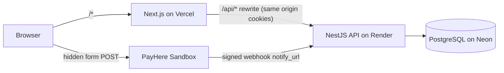
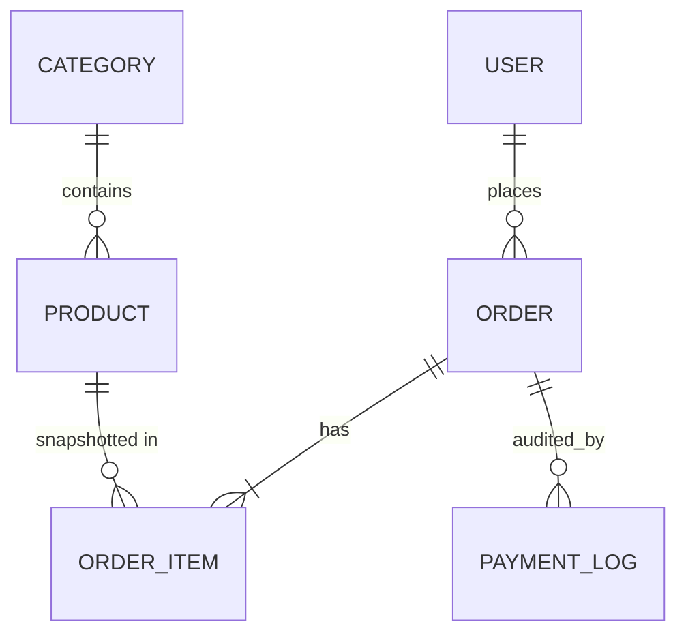
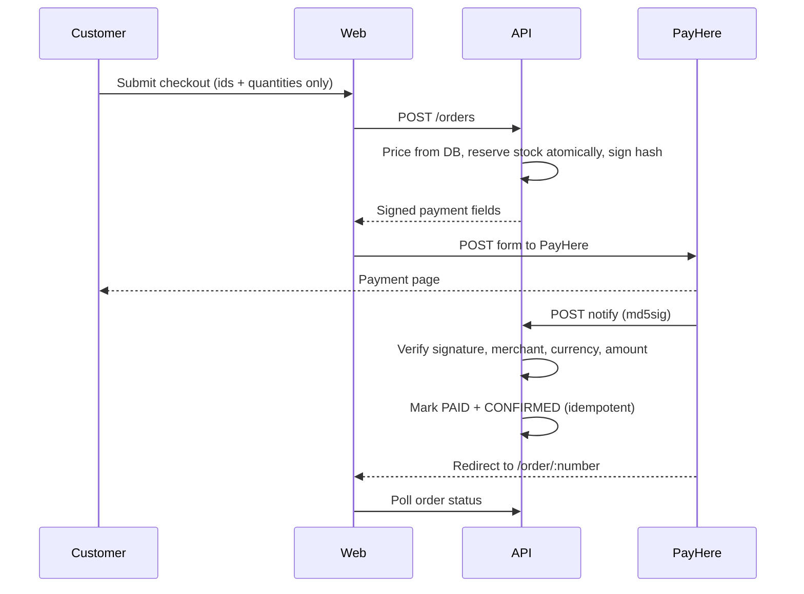

# MealRush – Restaurant Online Ordering Platform

A full-stack, responsive e-commerce application for a restaurant: customers browse the menu, add items to a cart and check out either with **PayHere (sandbox)** online payment or by sending the complete order to the restaurant on **WhatsApp**. An **Admin Panel** manages the menu, stock and orders.

- **Live app:** <<https://meal-rush-web.vercel.app>>
- **API:** <<https://mealrush-api.onrender.com/api/v1/health>>
- **Repository:** <<https://github.com/YOUR_USERNAME/meal-rush-ordering-platform>>

### Demo credentials
| Role | Email | Password |
|---|---|---|
| Admin | <<admin@mealrush.lk>> | <<your admin password>> |

> The API runs on a free tier. If the very first request is slow, the server was waking up.
> PayHere is in **sandbox** mode: use PayHere's test cards. No real money moves.

## Features
**Customer:** menu with search, category and veg filters and pagination · product details · persistent cart · guest or registered checkout · PayHere payment · WhatsApp order · live order status page with progress timeline · login/register.

**Admin:** dashboard (today's orders, paid revenue, pending orders, low-stock alerts) · order list with filters and search · order detail with status workflow · product CRUD with stock and availability · category CRUD.

## Tech stack
| Layer | Technology | Why |
|---|---|---|
| Frontend | Next.js (App Router), TypeScript, Tailwind CSS | Server-rendered pages, fast, responsive |
| State | Zustand | Light cart and auth state, cart saved in localStorage |
| Backend | NestJS, TypeScript | Modular structure: controllers, services, DTOs, guards |
| Database | PostgreSQL (Neon) | Relational data: orders, items, stock |
| ORM | Prisma | Typed queries, migrations |
| Auth | JWT in httpOnly cookie, bcrypt | Not readable from JavaScript, role-based access |
| Payments | PayHere Sandbox | Required by the brief |
| Hosting | Vercel (web), Render (API), Neon (DB) | Free tiers |

## Architecture

The browser only talks to the Next.js origin. Next.js proxies `/api/*` to the NestJS API, so the login cookie is first-party (works on Safari/iOS). PayHere's webhook calls the API directly.

```
apps/
├── api/   NestJS: auth, categories, products, orders, payments (+ prisma/ schema, migrations, seed)
└── web/   Next.js: storefront, checkout, order tracking, admin panel
```

## Database design

- **OrderItem stores a snapshot** of product name and unit price, so later menu edits never change past orders.
- Money uses `Decimal(10,2)`, never floats.
- `Order.userId` is optional, so guests can check out.
- Indexes on foreign keys, order status and creation date.

### Order lifecycle
`PENDING → CONFIRMED → PREPARING → OUT_FOR_DELIVERY → DELIVERED`, with `CANCELLED` allowed before delivery. The API rejects invalid jumps. Cancelling returns the stock.

## Checkout flows
**PayHere:**

**WhatsApp:** the order is saved first (so it appears in the admin panel), then the API returns a `wa.me` link containing a readable message with customer details, items, quantities, totals and notes. The customer taps "Send order on WhatsApp".

## Security approach
- Passwords hashed with bcrypt (cost 12); JWT in an **httpOnly, secure, SameSite** cookie.
- Role-based guards: every `/admin/*` route requires a valid session **and** the `ADMIN` role. The frontend redirect is only for UX.
- Registration always creates a `CUSTOMER`; roles can't be sent by clients.
- DTO validation (`class-validator`) with whitelisting: unknown fields are rejected.
- **Server-side pricing**: clients send only product IDs and quantities.
- **Atomic stock reservation** (`UPDATE ... WHERE stock >= qty`) inside a transaction: no overselling.
- PayHere: hash generated server-side; the secret is never sent to the browser; the webhook verifies `md5sig` (timing-safe), merchant ID, currency and amount; handling is idempotent.
- Public order tracking uses unguessable order numbers and returns no personal data.
- Secrets live in environment variables (`.env` is git-ignored; `.env.example` is provided).
- Helmet headers, CORS allow-list, rate limiting (stricter on login/register/orders), generic login error message.

## API overview
| Method | Path | Access |
|---|---|---|
| POST | `/auth/register`, `/auth/login`, `/auth/logout` | Public |
| GET | `/auth/me` | Logged in |
| GET | `/categories`, `/products`, `/products/:slug` | Public |
| POST | `/orders` | Guest or customer |
| GET | `/orders/track/:orderNumber` | Public, no personal data |
| GET | `/orders/my` | Customer |
| POST | `/payments/payhere/notify` | PayHere webhook (signature verified) |
| CRUD | `/admin/products`, `/categories` (write) | Admin |
| GET/PATCH | `/admin/orders`, `/admin/orders/:id` | Admin |
| GET | `/admin/stats` | Admin |

## Local setup
Requirements: Node 20.19+ (22 LTS recommended), a PostgreSQL database (Neon free tier works).

```bash
git clone <<repo url>>
cd meal-rush-ordering-platform

# API
cd apps/api
cp .env.example .env        # then fill in the values
npm install
npx prisma migrate dev
npx prisma db seed          # creates the admin user and sample menu
npm run start:dev           # http://localhost:4000/api/v1

# Web (new terminal)
cd apps/web
cp .env.example .env.local
npm install
npm run dev                 # http://localhost:3000
```

### Environment variables (`apps/api/.env`)
| Variable | Purpose |
|---|---|
| `DATABASE_URL` / `DIRECT_URL` | Pooled / direct PostgreSQL connection strings |
| `JWT_SECRET` | Signs login tokens |
| `FRONTEND_URL` | Web origin (CORS and PayHere return URLs) |
| `API_PUBLIC_URL` | Public API URL (PayHere `notify_url`) |
| `WHATSAPP_NUMBER` | Restaurant WhatsApp number, digits only with country code |
| `PAYHERE_MERCHANT_ID`, `PAYHERE_MERCHANT_SECRET`, `PAYHERE_CHECKOUT_URL` | PayHere sandbox |
| `ADMIN_EMAIL`, `ADMIN_PASSWORD` | Used by the seed script only |

`apps/web/.env.local`: `API_URL` (the API origin used by the proxy).

Testing the PayHere webhook locally: PayHere can't reach `localhost`, so use
`npx tsx scripts/simulate-payhere.ts <orderNumber> <amount e.g. 2900.00> 2` in `apps/api` (sends a correctly signed notification).

## Key technical decisions
- **NestJS + Next.js split** for a clear API boundary and independently deployable parts.
- **Proxy rewrite** instead of cross-site cookies, which Safari blocks.
- **Stock is reserved at order time** and released if an online payment is never completed (scheduled cleanup every 5 minutes, 30-minute window) or the admin cancels.
- **WhatsApp orders are saved server-side** before opening WhatsApp, so the admin sees every order even if the customer never sends the message.
- **Payment status is changed only by the verified webhook** for PayHere orders; admins can mark WhatsApp orders paid manually (cash on delivery).

## Assumptions and limitations
- PayHere runs in sandbox; test cards only.
- Delivery fee is a flat Rs. 300, free from Rs. 5,000 (constants in the code).
- Product images are URLs (no upload yet).
- A payment confirmation arriving after an unpaid order was auto-cancelled would need manual handling by the admin.
- Free-tier hosting: cold starts; a monitor keeps the API warm.
- No email notifications, tests are minimal, and there is no refund flow.

## Future improvements
Image uploads (Cloudinary), email/SMS order notifications, real-time order updates (WebSockets), automated tests, order history page for customers, refunds, AI-based dish recommendations.